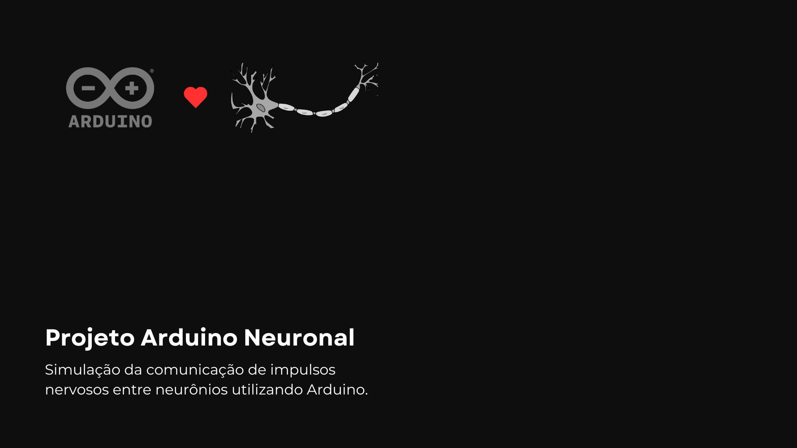
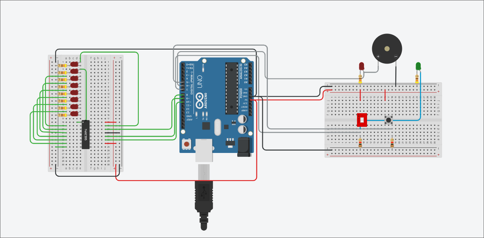

# Projeto Arduino Neuronal

</img>

<p align="center" style="font-size: 1.12rem">
  Simulação da comunicação de impulsos nervosos entre neurônios utilizando Arduino.
</p>

## Objetivo

O projeto "Arduino Neuronal" tem como objetivo demonstrar a comunicação de impulsos nervosos entre neurônios utilizando a plataforma Arduino. A simulação inclui a representação da bainha de mielina, uma estrutura responsável pela isolação do axônio, e como a ausência dessa bainha pode afetar a transmissão dos impulsos nervosos. Através deste projeto, pretende-se ilustrar de forma prática e didática o funcionamento dos neurônios e a importância da bainha de mielina na comunicação neuronal.

## Lista de Materiais

- 1x placa Arduino UNO
- 1x Registrador de Deslocamento de 8 bits (74hc595)
- 9x LEDs vermelho
- 1x LED verde
- 10x resistores 430 Ω
- 2x resistores 1 kΩ
- 1x botão
- 1x Buzzer sonoro
- 1x Interruptor de um canal
- Fios Jumpers

## Esquema de Ligação

A ligação do projeto na placa de prototipação segue a seguinte ordem:

</img>

### Registrador de deslocamento de 8 bits (Shift Register)

#### Pinos de controle

| Pino (Componente)                 | Pino (Arduino) | Função                                |
| --------------------------------- | -------------- | ------------------------------------- |
| GND                               | GND            | Alimentação 0V                        |
| VCC                               | 5V             | Alimentação 5V                        |
| STCP (Storage Register Clock Pin) | D8             | Retornar os bits armazenados          |
| DS (Data Serial Input Pin)        | D9             | Receber os bits enviados pelo Arduino |
| SHCP (Shift Register Clock Pin)   | D10            | Deslocar o registrador                |

#### Pinos de saída

| Pino (Componente) | Componente | Função            |
| ----------------- | ---------- | ----------------- |
| Q0                | LED 1      | Controle do LED 1 |
| Q1                | LED 2      | Controle do LED 2 |
| Q2                | LED 3      | Controle do LED 3 |
| Q3                | LED 4      | Controle do LED 4 |
| Q4                | LED 5      | Controle do LED 5 |
| Q5                | LED 6      | Controle do LED 6 |
| Q6                | LED 7      | Controle do LED 7 |
| Q7                | LED 8      | Controle do LED 8 |

### Outros componentes

| Componente               | Pino (Arduino) | Função                                            |
| ------------------------ | -------------- | ------------------------------------------------- |
| Switch ON/OFF            | 7              | Ativa/desativa a bainha de mielina                |
| Indicador de interrupção | 6              | LED de alerta para interrupção do impulso nervoso |
| Botão Start              | 5              | Inicia a sequência de LEDs quando pressionado     |

## Interrupção do "impulso nervoso"

Para efeitos de demonstração, foi incluído um evento que simula a perda do impulso nervoso na comunicação entre os neurônios. Por padrão, há uma chance de 10% de que a perda possa ocorrer, entretanto, é possível alterar o percentual pela variável `chanceInterrupcao`:

```ino
int chanceInterrupcao = 10; // Chance de interrupção em porcentagem (10% por exemplo)
```
